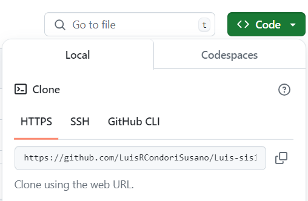
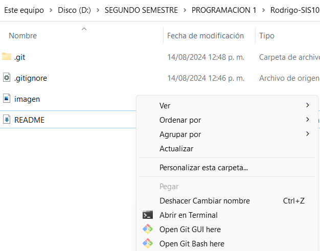

# PROGRAMACIÓN 1-SIS102

El proposito de este repositorio es la de contener los proyectos para la asignatura de Programación 1.

### Datos Personales:
* **Nombre Completo:** Luis Rodrigo Condori Susaño
* **Asignatura:** Programación 1 Sis-102


## Clonar un repositorio

Para clonar este repositorio, utiliza el siguiente comando en git bash:
1. Copia la URL del repositorio.

2. Abre Git Bash.
3. Navega a la carpeta donde deseas clonar el repositorio usando "cd" o abrela desde tu Explorador de Archivos.

```bash
$ cd Documents/
```
4. Usa el comando "git clone" y presiona enter.
```bash
$ git clone https://github.com/tu_usuario/tu_repositorio.git
```
5. Entra en la carpeta del repositorio clonado:
```bash
$ cd Nombre-SIS102/
```